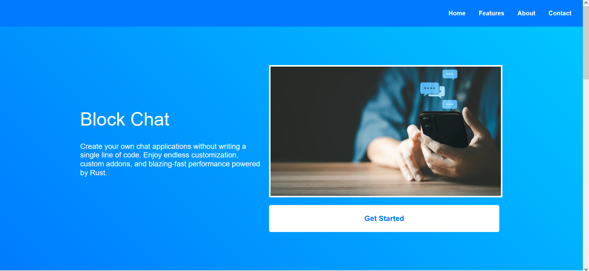
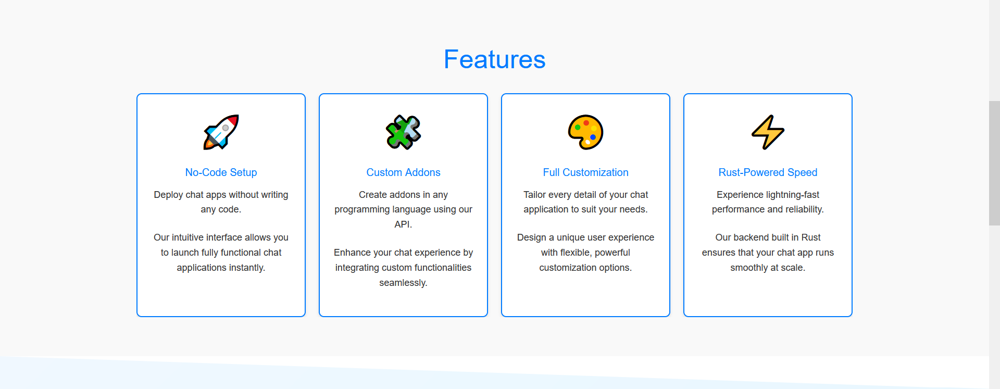
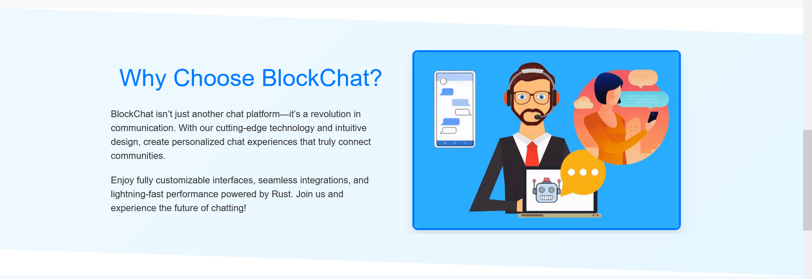
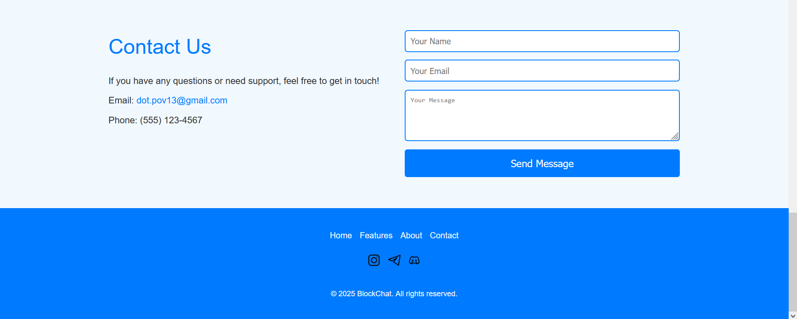

# BlockChat Landing Page

Welcome to the BlockChat landing page repository. This project is a fully responsive, creative landing page built with vanilla HTML and CSS that showcases the features of BlockChat—a service that empowers users to create their own customizable chat applications with a no-code setup, custom addons, and a blazing-fast Rust-powered backend.

## Project Overview

BlockChat is designed to let you build chat applications without any coding. The landing page demonstrates:

- **No-Code Setup:** Deploy chat apps instantly.
- **Custom Addons:** Integrate custom functionalities with your preferred programming language.
- **Full Customization:** Design every detail to match your unique requirements.
- **Rust-Powered Performance:** Enjoy robust, high-speed performance.

This repository contains all the code for the landing page along with modern design elements like smooth scrolling, interactive navigation, creative sections (hero, features, about, and contact), and a modern footer.

## Features

- **Smooth Scrolling:** Ensures a smooth user experience when navigating via anchor links.
- **Interactive Navigation:** Animated header links aligned to the right.
- **Hero Section:** Two-column layout with engaging text on the left and an image plus a large call-to-action on the right.
- **Enhanced Features Section:** Detailed feature blocks with icons and extra descriptive text.
- **Creative About Section:** A modern design featuring a diagonal cut background and a two-column layout.
- **Improved Contact Section:** A two-column layout with contact information and a constrained contact form.
- **Modern Footer:** Contains navigation links, social media icons (with inline SVGs recommended), and a copyright notice.

## Screenshots

### Navbar and Hero Section

### Features Section

### About Section

### Contact Us Section and Footer

## Live Demo

Check out the live demo of the BlockChat landing page here:  
[BlockChat Landing Page Demo](https://drive.google.com/file/d/1X4Kqvh1nEWe9bRqX4QCqwSL_hHOAaj36/view?usp=sharingcom)
